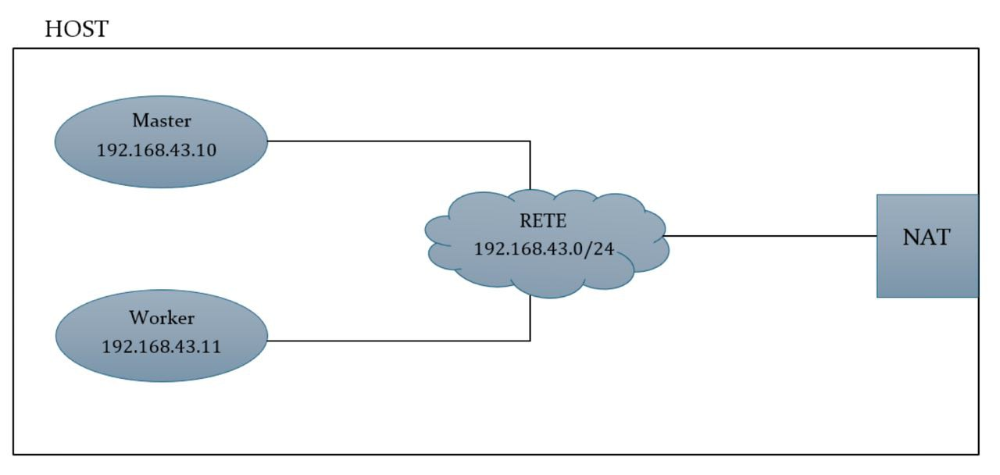
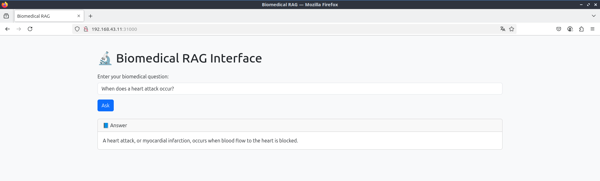

# Accesso a un sistema RAG biomedicale tramite Kubernetes

## Descrizione del progetto

Questo progetto consiste nell’esposizione di un sistema **RAG (Retrieval-Augmented Generation)** biomedicale all’interno di un cluster Kubernetes, rendendolo accessibile tramite un'interfaccia web.  

Il sistema è composto da due componenti principali:

1.  Backend RAG: un servizio Flask che carica e indicizza un ampio corpus di documenti biomedicali tramite embedding generati con PubMedBERT. Gli embedding sono indicizzati con FAISS per una ricerca efficiente. Il backend espone un endpoint API /query che riceve domande e restituisce risposte basate sui documenti più rilevanti.

2.  Frontend Web: un’interfaccia Flask con pagina HTML che permette agli utenti di inserire domande e visualizzare le risposte ottenute dal backend. Il frontend invia richieste al backend tramite chiamate HTTP.


L’obiettivo non è tanto analizzare il modello RAG, quanto mostrare come containerizzare e rendere accessibile un servizio su un cluster Kubernetes distribuito (1 master + 1 worker), con un focus sull’architettura, il deployment e l’accesso esterno.

---


## Architettura del cluster

Il cluster kubernetes è costituito da due macchine virtuali su cui è installato Xubuntu 24. 

Le due macchine virtuali sono connesse ad una rete con NAT gestita da VirtualBox. 

Per quanto riguarda i nodi kubernetes, una VM ospita il nodo master e l’altra il nodo worker:
* **master** (`192.168.43.10`)
* **worker** (`192.168.43.11`)




---


## Struttura del sistema

```
.
├── rag-biomed/
│   ├── app.py     
│   ├── documents.txt           
│   ├── build_index.py           
│   ├── biomed_index.faiss     
│   ├── docs_store.txt        
│   └── Dockerfile
│
├── rag-k8s/
│   ├── deployment.yaml
│   └── service.yaml
│
├── rag-ui-k8s/
│   ├── app.py
│   ├── requirements.txt
│   ├── rag-flask-ui-deployment.yaml
│   ├── rag-flask-ui-service.yaml
│   ├── Dockerfile
│   └── templates/        
│       └── index.html
│ 
```


## Implementazione RAG

### Dataset

Il dataset `documents.txt`contiene circa 160 frasi cliniche e scientifiche di alta qualità sull’apparato cardiovascolare.

### Costruzione indice

Il file `build_index.py` carica PubMedBERT, un modello BERT pre-addestrato su articoli biomedici, legge il dataset e genera embedding. 
Costruisce quindi un indice FAISS e lo salva su `biomed_index.faiss`.
Salva anche tutti i documenti in `docs_store.txt` per mantenerli allineati con l’indice FAISS.
L’indice FAISS e i documenti originali sono salvati su disco per un rapido caricamento.

A questo punto è necessario installare le dipendenze per poi procedere alla generazione dell'indice:
`pip install torch transformers faiss-cpu flask requests numpy`

Generiamo l’indice FAISS attraverso il comando:

```bash
python build_index.py
```

### Backend RAG
Il backend Flask `app.py` espone un endpoint /query che riceve query testuali, calcola embedding, effettua ricerca nell’indice FAISS e restituisce il documento più rilevante come risposta.

Avviare il backend RAG:
```bash
python app.py
```

### Dockerizzazione
Il RAG è contenuto in un'immagine Docker costruita localmente e caricata su DockerHub.

`rag-biomed/Dockerfile`:

```Dockerfile
FROM python:3.10-slim

WORKDIR /app

COPY . .

ENV KMP_DUPLICATE_LIB_OK=TRUE

RUN pip install --no-cache-dir flask torch transformers faiss-cpu

EXPOSE 5000

CMD ["python", "app.py"]
```

Eseguire i comandi:
```bash
docker build -t giuliagiglioni/rag-biomed:latest .

docker push giuliagiglioni/rag-biomed:latest
```


### Kubernetes
Creazione Deployment e Service per il RAG appena creato.

```yaml
# deployment.yaml
	
apiVersion: apps/v1
kind: Deployment
metadata:
    name: rag-deployment
spec:
    replicas: 1
    selector:
    matchLabels:
        app: rag
    template:
    metadata:
        labels:
        app: rag
    spec:
        containers:
        - name: rag-container
        image: giuliagiglioni/rag-biomed:latest
        ports:
        - containerPort: 5000

# service.yaml

apiVersion: v1
	kind: Service
	metadata:
	  name: rag-service
	spec:
	  selector:
		app: rag
	  type: NodePort
	  ports:
		- protocol: TCP
		  port: 80
		  targetPort: 5000

```

Eseguire i comandi:

`kubectl apply -f deployment.yaml`

`kubectl apply -f service.yaml`


Per testare:
```bash
kubectl get pods

kubectl get svc
```

## Implementazione interfaccia RAG 

L’interfaccia utente è stata implementata in Flask con un template HTML basato su Bootstrap per un aspetto semplice e pulito.

### Frontend Web

Il file app.py crea una web app con Flask per interrogare il sistema di RAG (Retrieval-Augmented Generation).
Invia richieste HTTP POST al backend (servizio RAG), recupera le risposte e le mostra nella pagina `index.html`.


File `app.py`:
```yaml
from flask import Flask, request, render_template
import requests

app = Flask(__name__)

RAG_ENDPOINT = "http://rag-service:80/query"  # Nome del service Kubernetes del RAG

@app.route("/", methods=["GET", "POST"])
def index():
    answer = None
    query = None

    if request.method == "POST":
        query = request.form.get("query")
        try:
            response = requests.post(RAG_ENDPOINT, json={"query": query}, timeout=5)
            data = response.json()
            answer = data.get("result", "No answer found.")
        except Exception as e:
            answer = f"Errore nella richiesta al RAG: {e}"

    return render_template("index.html", answer=answer, query=query)
```

Il file index.html è un template HTML per l'interfaccia utente di una web app Flask.
Serve a creare una pagina web interattiva per porre domande biomedicali a un sistema RAG (Retrieval-Augmented Generation).

File `index.html`:
```yaml
<!DOCTYPE html>
<html lang="en">
<head>
  <meta charset="UTF-8" />
  <title>Biomedical RAG</title>
  <link href="https://cdn.jsdelivr.net/npm/bootstrap@5.3.0/dist/css/bootstrap.min.css" rel="stylesheet">
</head>
<body class="bg-light">

<div class="container py-5">
  <h1 class="mb-4">🔬 Biomedical RAG Interface</h1>

  <form method="POST" class="mb-4">
    <div class="mb-3">
      <label for="query" class="form-label">Enter your biomedical question:</label>
      <input type="text" class="form-control" id="query" name="query" value="{{ query or '' }}" required>
    </div>
    <button type="submit" class="btn btn-primary">Ask</button>
  </form>

  
  <div class="card">
    <div class="card-header">📘 Answer</div>
    <div class="card-body">
      <p class="card-text">{{ answer }}</p>
    </div>
  </div>
  
</div>

</body>
</html>
```


---

### Dockerizzazione

`rag-ui-k8s/Dockerfile`:

```Dockerfile
FROM python:3.10-slim

WORKDIR /app

COPY requirements.txt .
RUN pip install --no-cache-dir -r requirements.txt

COPY . .

ENV FLASK_APP=app.py
ENV FLASK_RUN_HOST=0.0.0.0
ENV FLASK_RUN_PORT=5000

EXPOSE 5000

CMD ["flask", "run"]
```

Eseguire i comandi:
```bash
docker build -t giuliagiglioni/rag-flask-ui:latest .

docker push giuliagiglioni/rag-flask-ui:latest
```


### Kubernetes
Creazione Deployment e Service per l'interfaccia appena creata.

```yaml
# rag-flask-ui-deployment.yaml  
	
apiVersion: apps/v1
kind: Deployment
metadata:
  name: rag-flask-ui
spec:
  replicas: 1
  selector:
  matchLabels:
    app: rag-flask-ui
  template:
  metadata:
    labels:
    app: rag-flask-ui
  spec:
    containers:
    - name: rag-flask-ui
    image: giuliagiglioni/rag-flask-ui:latest
    ports:
    - containerPort: 5000

# rag-flask-ui-service.yaml

apiVersion: v1
kind: Service
metadata:
  name: rag-flask-ui
spec:
  type: NodePort
  selector:
  app: rag-flask-ui
  ports:
  - port: 5000
    targetPort: 5000
    nodePort: 31000  

```

Il servizio Kubernetes è di tipo NodePort, per consentire l’accesso esterno.

Eseguire i comandi:

```bash
kubectl apply -f rag-flask-ui-deployment.yaml

kubectl apply -f rag-flask-ui-service.yaml
```


Per testare:

```bash
kubectl get pods

kubectl get svc
```

---


## Accesso al Servizio (Accesso al RAG)

`rag-flask-ui` espone l'interfaccia web sulla porta 31000 del nodo.

L’interfaccia web comunica con il servizio RAG tramite il nome del servizio Kubernets (`rag-service`) sulla porta 80, visibile solo internamente cluster.

L’utente interagisce con il sistema tramite browser visitando `http://ip-nodo:31000`.

L’indirizzo per accedere all’interfaccia web del RAG diventa quindi: `http://192.168.43.11:31000`

L'utente quindi apre il browser all'indirizzo specificati, inserisce una domanda e ottiene la risposta.


---


## Test

L'applicazione è stata testata con successo inviando domande come:

```text
When does a heart attack occur?	
```

Il servizio ha risposto restituendo il documento biomedicale più simile semanticamente, dimostrando il corretto funzionamento sia della pipeline RAG che della distribuzione Kubernetes.



---

## Possibili estensioni

Migliorare il modello RAG con fine-tuning su dataset più ampi.

Estendere l’interfaccia web con cronologia delle domande.

Implementare caching delle risposte frequenti.


---

## Conclusioni

Questo progetto mostra come strutturare e rendere accessibile un microservizio RAG all’interno di Kubernetes.
Il frontend e il backend sono completamente separati e comunicano tramite Service interni, seguendo le best practice di orchestrazione.
Il sistema è scalabile, portabile e facilmente estendibile, e rappresenta un valido prototipo per ambienti di produzione.

Il progetto ha dimostrato la fattibilità di costruire un sistema RAG biomedicale efficiente e accessibile tramite una semplice interfaccia web. 
L’uso di modelli preaddestrati specializzati come PubMedBERT e l’indicizzazione FAISS ha permesso di realizzare una soluzione performante in ambiente locale, facilmente estendibile e migliorabile in futuro.

---
## Autore
Giulia Giglioni


---

